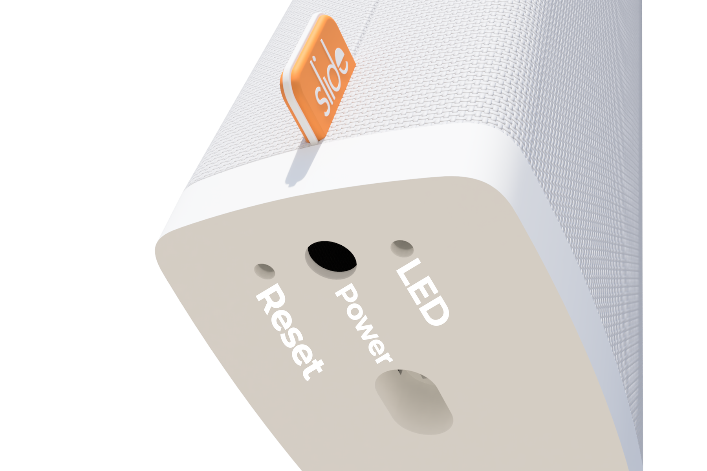

# Factory Reset

1. Using the reset button  

The reset button is placed in an opening on the bottom of Slide, opposite the opening with the light. Use something like a paperclip to push and hold the reset button for  at least 10 seconds. Slide will return to factory settings and the light will start pulsating (going on and off slowly). The hard reset is now complete.

