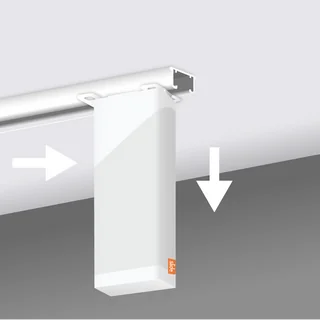
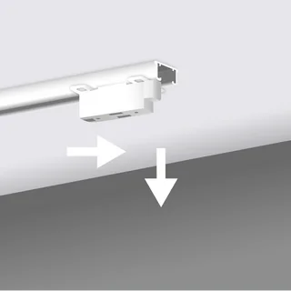

# Remove or disassemble Slide

## Slide on double curtains

1. Take the power cable out of Slide (A)

2. Take your curtains off the First Connector (G) and the Second Connector (I + J)

3. Remove the Clip Protector (H) and the Connector Clip (F) from the First Connector (G)

4. Remove the Clip Protector (H) and the Connector Clip (F) from the Second Connector (I + J) and take it off the cable.

5. Now unhook the curtain from Slide (A) and the Pulley (E)

6. Pull the Pulley (E) horizontally towards the end of your curtain track. When you a *click*, you can slowly move it downwards to remove it and slowly move the Pulley (E) towards Slide (A) (the motor). Do this calmly so that Slide has time to roll up the cable.

7. Detach Slide (A), by pulling it towards the other end of your curtain track. When you hear a clear *click*, you can slowly move it downwards to remove it.

8. Remove the Mount Pins (D) from the Slide Mount (B) to take it off your curtain track

9. Repeat this with the Mount Pins (D) and the Slide Mount (B) on the other side.

10. Hook your curtains back into the runners and stoppers of your curtain track.

  
  
